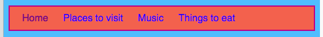

## Modelarea barei de meniu

Cu CSS, posibilitățile de a face bara de meniu să arate bine sunt nesfârșite.

- Deplasați-vă din nou la fișierul `stiles.css` - locul unde se întâmplă lucrurile interesante!

- Găsiți selectorul `nav ul` și adăugați mai multe reguli astfel încât să pară următoarele:

```css
  nav ul {culoare-fundal: tomate; stilul frontal: solid; culoarea frontală: MediumVioletRed; lățimea frontală: 2px; padding: 10px; }
```

Proprietatea `padding` adaugă spațiu. Puteți afla ce face fiecare dintre celelalte proprietăți? Încercați să experimentați diferite culori și numere de pixeli.


- Pentru a scapa de sublinierea link-urilor, adăugați următorul cod pe o linie nouă după încheierea cursei `}` pentru cele `reguli nav nav`. Ai putea pune - l după orice `}`, dar este o idee bună de a păstra lucrurile legate împreună , astfel că este mai ușor de găsit!

```css
  nav ul li a {text-decorare: nimic; }
```

Regula de mai sus se aplică legăturilor `<a>` elementele de listă `<li>` într-o listă neordonată `<ul>` în interiorul unei secțiuni de navigare `<nav>`. Wow, sunt patru selectori!



Amintiți-vă cum ați eliminat etichetele de legătură de la unele elemente din listă din secțiunea `<nav>` astfel încât să puteți vedea cu ușurință ce pagină sunteți pe această pagină. De ce nu schimbați și culoarea textului acelor elemente din lista de navigare care nu sunt link-uri!

- Găsiți selectorul dvs. `ul li` și **în interior** coarde curl adăugați linia:

```css
  culoare: PapayaWhip;
```

Puteți alege orice culoare doriți!

Puteți adăuga proprietatea `color` la regula `nav ul li a` , dacă doriți ca legăturile de meniu să aibă o culoare diferită de celelalte linkuri de pe site-ul dvs. Web.

- Ce zici de câteva colțuri rotunjite pentru meniul tău? Încercați să adăugați următorul cod în regula `nav ul` pentru a vedea ce se întâmplă: `raza de graniță: 10 pixeli;`.

Proprietatea `de la raza de graniță` este o modalitate foarte ușoară de a face ceva să arate mai rece!


\--- provocare \---

## Provocare: face ca imaginile să aibă colțuri rotunjite

- În foaia dvs. de stil, creați un set nou de reguli pentru imagini utilizând selectorul `img` și adăugați o regulă `de rază` limitei.

\--- /provocare \---