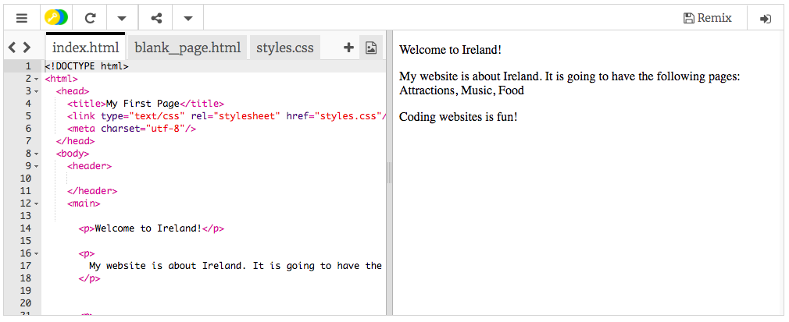

## Pentru început

- Mergi la [trinket-ul de început](http://dojo.soy/html-b-start). Vei vedea o casetă care conține un exemplu de proiect web. În partea dreaptă este website-ul, iar în partea stângă este codul care creează website-ul. 

## \--- collapse \---

## title: Am un cont Trinket

- Dă click pe butonul **Remix** din partea dreapta sus al proiectului. Dacă nu ești conectat, ți se va cere să te conectezi. După ce te-ai conectat, va trebui să dai click pe **Remix** din nou. Dând click pe acest buton, se creează o copie a proiectului pentru ca tu poți să lucrezi cu ea. 

Ar trebui să scrie **remixed** după ce dai click pe el:

\--- /collapse \---

## \--- collapse \---

## title: Nu am un cont Trinket

Îți poți salva munca utilizând una dintre opțiunile din meniul **Share**. Vei primi un link pe care îl poți salva undeva, cum ar fi într-un document, sau îl poți trimite către cineva prin e-mail. **Notă:** de fiecare dată când faci o schimbare, vei primi un nou link.

Dacă vrei să îți creezi un cont pe Trinket, urmează pașii de mai jos. Acest lucru îți va permite să îți accesezi munca cu ușurință de la orice calculator, dar și să **editezi** (remix) proiectele pe care altcineva le-a distribuit cu tine. Remixarea constă în salvarea unei copii a unui anumit proiect pentru ca tu să îi poți aduce modificări.

- Mergi pe [website-ul Trinket](http://dojo.soy/trinket) și dă click pe **Sign Up For Your Free Account**. Vei avea nevoie de o adresă de email pentru a te înregistra.

- Introdu adresa ta de email și alege o parolă, sau cere-i altcuiva să facă acest lucru pentru tine.

- Acum poți accesa toate proiectele tale salvate sau remixate dând click pe numele tău de utilizator, iar apoi pe **My Trinkets**. 

\--- /collapse \---

Să începem să scriem cod!