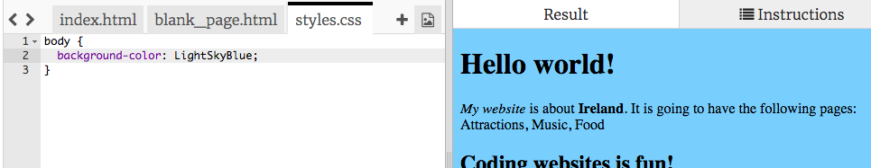

## Controlul cum arată

Codul care descrie cum arată un site Web se numește **CSS**.

- Uită-te la filele din partea de sus a panoului de cod și du-te la fișierul `styles.css` făcând clic pe fila cu acel nume. Fișierul conține următorul text:

```css
  corp {fundal-culoare: alb; }
```

- Schimbați culoarea `alb` la `LightSkyBlue` și vedeți ce se întâmplă. Site-ul dvs. web ar trebui să aibă acum un fundal albastru! 



## \--- colaps \---

## titlu: Cum funcționează?

Dacă te uiți la partea de sus a `index.html` fișier, veți vedea următoarea linie:

```html
  <link type="text/css" rel="stylesheet" href="styles.css"/>
```

Linia de mai sus îi spune browserului să caute un fișier special numit `styles.css`. Acest fișier special se numește **foaie de stil**. Puteți recunoaște un fișier de foi de stil cu ajutorul câmpului `.css` în numele acestuia.

O foaie de stil conține **reguli** pentru ceea ce ar trebui să arate fiecare element din pagina dvs. web.

Asamblările curl `{ }` și codul între ele sunt un set de **reguli CSS**. Cuvântul `corp` înseamnă că regulile sunt pentru toate cele `<body>` elemente de pe site-ul dvs. web. Se numeste bitul in fata bretelelor curl a **selector**. Deci, în acest caz, este selectorul pentru elementele corpului.

Fiecare regulă din interiorul bretelelor este formată din:

- A **proprietate** în stânga, urmată de un simbol de colon `:`
- O **valoare** pentru proprietate de pe partea dreaptă , după colon
- Un simbol semi-colon `;` la sfârșit

\--- / colaps \---

- Permite adăugarea de reguli pentru a schimba modul în care arată textul. Adăugați două linii noi în interiorul coastelor curbate:

```css
  corp {fundal-culoare: LightSkyBlue; font-family: "Helvetica", sans-serif; culoare: violet; }
```

Uitați-vă la modul în care a schimbat pagina web.

Proprietatea `color` este întotdeauna pentru text. Aici, setați culoarea întregului text din `corpul` al paginii web.

- De asemenea, puteți scrie reguli separate pentru titluri și paragrafe. Pentru `<h1>` titluri, utilizați selectorul `h1`. Sub breasla de închidere curbată care conține regula CSS pentru corp, adăugați următorul cod.

```css
  h1 {culoare: portocaliu; font-family: "Times New Roman", serif; }
```

Textul dvs. din titlu trebuie să fie acum portocaliu, cu paragraful purpuriu ca înainte.


Observați că literele arată, de asemenea, diferite, precum și culoarea diferită? Acest lucru se datorează faptului că ați schimbat familia de fonturi ****. Puteți găsi mai multe fonturi [aici](http://dojo.soy/web-font-families).

- Încercați să adăugați un set de reguli pentru pozițiile `<h2>` , utilizând selectorul `h2`.

- De ce nu experimentați diferite combinații de culori pentru text și fundal? Există multe culori disponibile pentru utilizare. Găsiți o listă completă a acestora [aici](http://dojo.soy/web-color-names).