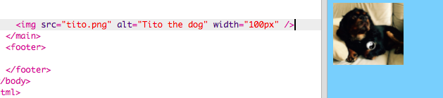

## Adăugarea de imagini

Să adăugăm o fotografie!

- Accesați fila numită `index.html`. Găsiți eticheta `</main>` și introduceți următoarele **mai sus** ea: 

```html
    
```

Iată ce ar trebui să arate rezultatul:



Observați că această etichetă conține informații suplimentare în interiorul acesteia. Ele sunt numite **atribute**.

- Găsiți bitul de cod care spune `width = "100px"` și încercați să experimentați numere diferite pentru a vedea dacă puteți afla ce face acest atribut. Nu ștergeți literele `px`!

\--- colaps \---

* * *

## titlu: Cum funcționează eticheta ``

Observați că eticheta `` este diferită de celelalte etichete pe care le-ați utilizat până acum - nu există nici o etichetă de închidere `</img>`. În schimb, această etichetă este **auto-închidere**: are cu `/ cu>` la sfârșitul anului . Acest lucru se datorează faptului că nu există nici un "început" și "sfârșit" pentru un element de imagine, ca și pentru text pe pagină.

Eticheta conține **atribute** cu informații suplimentare:

- Atributul `src` indică browserului ce fișier să utilizeze pentru imagine. 
- Atributul `alt` este o scurtă descriere pe care browserul o va afișa dacă nu poate afișa imaginea. "alt" este scurt pentru "alternativă". Acest text ajută, de asemenea, oamenii care folosesc un cititor de ecran să știe ce este imaginea.
- Atributul `lățime` indică browserului cât de largă este imaginea. `100px` înseamnă o sută de **pixeli**, care sunt punctele mici care alcătuiesc ceea ce vedeți pe ecran. Dacă nu includeți acest atribut, imaginea va fi afișată în dimensiunea originală.

\--- / colaps \---

Acum că știți codul pentru a pune o imagine pe site-ul dvs., probabil că doriți să schimbați imaginea, nu?

- Primul lucru de care ai nevoie este, desigur, o imagine! Puteți utiliza unul pe care l-ați primit deja pe computer, cum ar fi o fotografie pe care ați luat-o sau o puteți obține de pe internet.

[[[generic-get-picture-from-web]]]

**Notă:** nu toate imaginile pe care le veți găsi pe internet sunt gratuite pentru oricine să le folosească. Dacă descărcați o fotografie, trebuie să vă asigurați că este una pe care aveți voie să o utilizați. Aflați mai multe despre acest lucru aici:

[[[images-permissions-to-use]]]

Odată ce aveți o imagine, puteți **încărcare** fișier la Martisor:

- În trinket, faceți clic pe pictograma **imagine** lângă semnul **+**. 


Aici puteți vedea imaginile pe care le puteți utiliza pe site-ul dvs. web. Ar trebui să vezi imaginea lui Tito, câinele CoderDojo.

- Dați clic pe butonul **Adăugați Imaginea** și apoi faceți clic pe **Încărcați**.

- Faceți clic pe butonul **Faceți clic pe Pentru a selecta fișierele**. Găsiți și faceți dublu clic pe fișierul imagine în fereastra care se deschide.

- Faceți clic pe **Efectuat**.


Fotografia dvs. va fi încărcată și ar trebui să fie gata de utilizare.

- Du - te la fișierul `index.html` și găsiți `` tag - ul. Schimbați textul `tito.png` astfel încât să se potrivească exact cu numele fișierului imagine pe care l-ați ales. Rețineți că numele său s-ar putea termina în `.jpg` în loc de `.png`!

Textul pe care tocmai l-ați modificat este atributul numit `src`, care îi spune browserului care fișier să fie afișat.

**Notă:** valoarea pe care o introduceți pentru un atribut trebuie să conțină ghilimele `""` jurul acestuia!

\--- provocare \---

## Provocare: schimbați alt text al imaginii

- Găsiți atributul `alt` al elementului dvs. de imagine și schimbați textul într-o scurtă descriere a imaginii. 

\--- /provocare \---