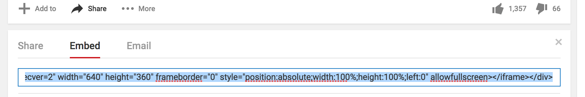
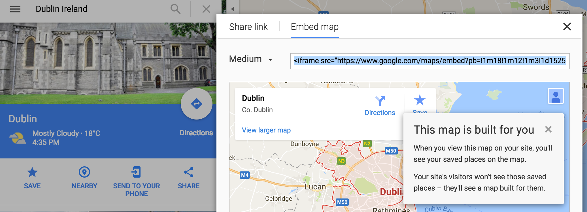

## Adăugarea unei hărți sau a unui videoclip

YouTube oferă o modalitate ușoară de a adăuga videoclipurile pe site-ul dvs. web. Adăugarea de elemente din alte surse online pe site-ul dvs. Web se numește și **încorporare**.

- Găsiți un videoclip pe YouTube pe care doriți să îl afișați pe site-ul dvs. web.

- Faceți clic pe butonul **Trimiteți** sub videoclip. Selectați opțiunea **Embed**.

Veți vedea o casetă text cu tot textul selectat. Dacă ștergeți din greșeală textul, puteți să-l selectați din nou făcând clic pe el și apăsând simultan tastele <kbd>Ctrl</kbd> (sau <kbd>cmd</kbd> pe Mac) și <kbd>A</kbd>.

- Apăsați pe tastele <kbd>Ctrl</kbd> (sau <kbd>cmd</kbd> pe Mac) și <kbd>C</kbd> împreună pentru a copia textul.

- Apoi, reveniți la codul HTML al site-ului dvs. web și dați clic în locul în care doriți să plasați videoclipul, de exemplu sub un titlu sau un paragraf. **Lipiți** codul apăsând <kbd>Ctrl</kbd> (sau <kbd>cmd</kbd> pe un Mac) și <kbd>V</kbd> pe tastatură în același timp. Nu vă faceți griji cu privire la înțelegerea codului pe care tocmai l-ați lipit!

Ar trebui să vedeți că videoclipul apare pe pagina dvs. web.

Aceeași tehnică funcționează și pentru hărțile Google. Încearcă!

- Du-te [aici](http://dojo.soy/google-maps) și căutați un loc pe care doriți să-l afișați pe site-ul dvs. **Notă:** **nu** împărtășesc informații personale cum ar fi adresa dvs. de domiciliu pe un site web!

- Dați clic pe rezultatul, apoi dați clic pe butonul **Trimiteți** și copiați codul și adăugați-l pe site-ul dvs. web, așa cum este prezentat mai sus. 

- Dacă te uiți cu atenție, ar trebui să găsești `latime` și `înălțime` **atribute** în codul lipit. Puteți schimba valorile acestora pentru a face harta să fie mai mare sau mai mică.

