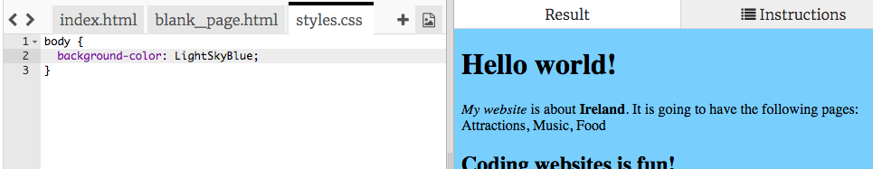

## Controlling how it looks

The code that describes what a website looks like is called **CSS**.

- Look at the tabs at the top of the code panel, and go to the file `styles.css` by clicking on the tab with that name. The file contains the following text:

```css
  body {
      background-color: white;
  }
```

- Change the `white` colour to `LightSkyBlue` and see what happens. Your website should now have a blue background! 



## - - 自動隱藏選單 - -

## title: How does it work?

If you look at the top of the `index.html` file, you will see the following line:

```html
  <link type="text/css" rel="stylesheet" href="styles.css"/>
```

The above line tells the browser to look for a special file named `styles.css`. This special file is called a **style sheet**. You can recognise a style sheet file by the `.css` in its name.

A style sheet contains **rules** for what each element on your webpage should look like.

The curly braces `{ }` and the code in between them are a set of **CSS rules**. The word `body` means that the rules are for all the `<body>` elements on your website. We call the bit in front of the curly braces a **selector**. So in this case, it is the selector for the body elements.

Each rule inside the curly braces is made up of:

- A **property** on the left, followed by a colon symbol `:`
- A **value** for the property on the right-hand side after the colon
- A semi-colon symbol `;` at the end

\--- /collapse \---

- Lets add rules to change how the text looks. Add two new lines inside the curly braces:

```css
  body {
    background-color: LightSkyBlue;
    font-family: "Helvetica", sans-serif;
    color: purple;
  }
```

Look at how this has changed the webpage.

The `color` property is always for text. Here, you are setting the colour of all text in the `body` of your webpage.

- You can also write separate rules for the headings and the paragraphs. For `<h1>` headings, you use the `h1` selector. Below the closing curly brace containing the CSS rule for the body, add the following code.

```css
  h1 {
    color: orange;
    font-family: "Times New Roman", serif;
  }
```

Your heading text should be orange now, with the paragraph in purple as before.


Notice how the letters also look different as well as being a different colour? This is because you changed their **font family**. You can find some more fonts [here](http://dojo.soy/web-font-families).

- Try adding a set of rules for the `<h2>` headings, using the `h2` selector.

- Why not experiment with different colour combinations for the text and background? There are lots of colours available to use. Find a full list of them [here](http://dojo.soy/web-color-names).